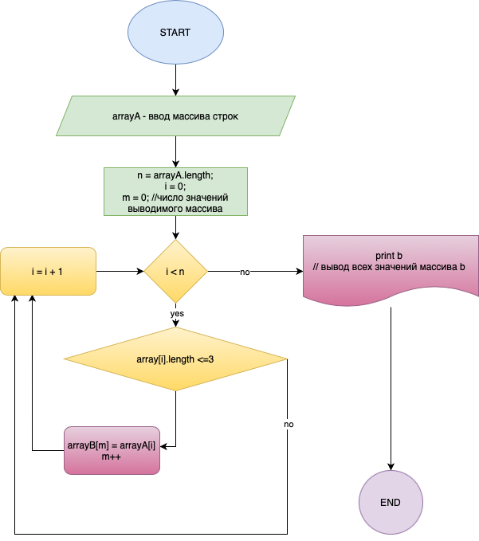

# __Итоговая проверочная работа:__

|*Номер задачи*|*Описание задачи*|*Результат выполнения*|
| :-: | :-: | :-: |
| 1 |Создать репозиторий на GitHub:|
<https://github.com/SolnechnayaS/GeekBrains_Final_1Q.git>

|
| 2 |Нарисовать блок-схему алгоритма (можно обойтись блок-схемой основной содержательной части, если вы выделяете ее в отдельный метод)|
Создан файл algoritm.png

|
| 3 |Снабдить репозиторий оформленным текстовым описанием решения (файл README.md)|
1) Пользователь вводит с клавиатуры планируемое количество вводимых строк (n);

2) Программа создает строковый массив arrayA на заданное пользователем количество строк (n) и просит ввести строки массива;

3) С помощью цикла for программа считает количество элементов массива (m), в которых количество символов не превышает 3;

4) Программа создает новый массив с числом элементов (m) для вывода результирующего массива;

5) С помощью цикла for и условия if программа записывает элементы исходного массива (arrayA или array), в которых количество символов не превышает 3, в результирующий массив (arrayB или newarray);

6) С помощью команды Console.WriteLine программа выводит элементы результирующего массива на экран в формате […, …, … ].

|
| 4 |
Написать программу, решающую поставленную задачу:

Написать программу, которая из имеющегося массива строк формирует массив из строк, длина которых меньше либо равна 3 символа. Первоначальный массив можно ввести с клавиатуры, либо задать на старте выполнения алгоритма. При решении не рекомендуется пользоваться коллекциями, лучше обойтись исключительно массивами.
|
Программа оформлена в двух вариантах:

1) Простой вывод всех элементов с длиной до 3-х символов в строке:

Final\_SimplePrint;

2) Согласно алгоритму выше с формированием нового результирующего массива:

Final\_TwoArrays.
|
| 5 |Использовать контроль версий в работе над этим небольшим проектом (не должно быть так что все залито одним коммитом, как минимум этапы 2, 3 и 4 должны быть расположены в разных коммитах)|Все задания закоммитированы в разных ветках |

